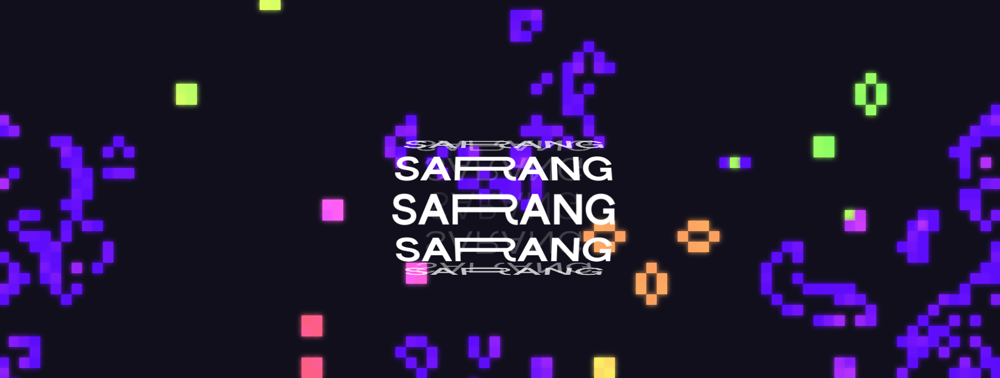

# Text-Animation-Effect
Text Animation Effects
A collection of modern, performant text animation effects built with vanilla JavaScript and CSS.

✨ Features
Multiple Animation Styles - Typewriter, scramble, fade, and more

Performance Optimized - Smooth 60fps animations

Zero Dependencies - Pure vanilla JavaScript

Lightweight - Minimal bundle size

Easy to Customize - Simple configuration options

Responsive Design - Works on all devices

🎯 Live Demo
View Live Demo

🛠️ Technologies Used
HTML5

CSS3 with CSS Variables

Vanilla JavaScript

CSS Animations & Transitions

🚀 Quick Start
bash
# Clone the repository
git clone https://github.com/sarangnayak/Text-Animation-Effect

# Navigate to project directory
cd Text-Animation-Effect

# Open in browser
open index.html
